## 1.关于寝室电费

每个寝室的电费独立结算，电费通过学校提供缴费平台充值，不支持现金，直接从缴费者的校园卡里扣钱，所以交电费之前需确保校园卡里有足够的余额。  
我们学校电费响应速度极快，没电费了立刻断电，充值电费之后几秒内立刻来电。 这就是上每力大学。

## 2.如何缴纳电费
::: tip

由于10号宿舍楼为新宿舍，其不同于老宿舍的缴纳电费方式，有专门的缴费接口。

所以本小节分为两部分，分别介绍新老宿舍的缴纳方式。

:::

::: warning

无论是新宿舍还是老宿舍，在缴纳电费时都需要**先接入校园网**，请先完成这一步，再继续以后的步骤。

如何接入校园网，可以参看本站中的《上海电力大学校园网上网手册》，这里不再赘述。

值得一提的是，寝室里自己办理的网络不是校园网，不能直接访问缴费平台，需要借助VPN接入校园网，关于VPN的使用也已在《上网手册》中说明。

:::

::: warning

由于涉及到金钱交易，请在充值前仔细核对**寝室楼号、寝室号、充值金额**是否合理正确！！！

一旦缴费，不予退款。

如果交错寝室了，可以自行协商或者寻求宿管帮助。

:::

### 新宿舍楼的缴费方式

新宿舍楼即2025投入使用的10号宿舍，其有不同于旧宿舍充值的专门接口。

1. 微信端搜索并关注公众号：电力E后勤  

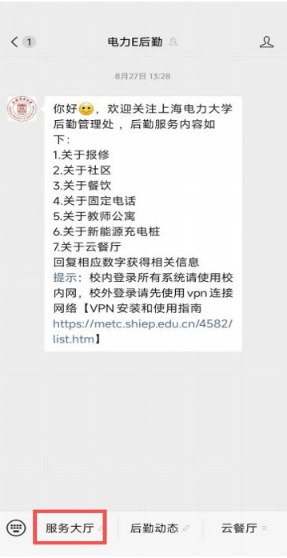

2. 点击“临港10号公寓充电”

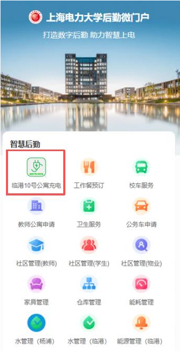

3. 在线支付登录页： 选择“校区”，搜索“宿舍号”（A区则输入‘A’点击搜索，B区同理，不然可能默认显示空白）。登录

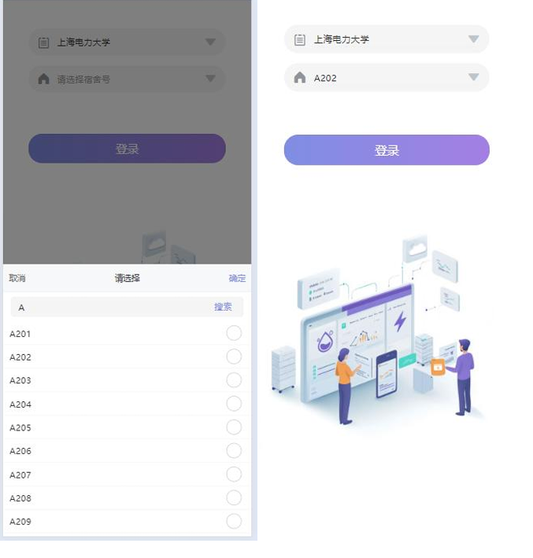

4. 进入宿舍详情页面
可以查看仪表能耗、仪表费用状态、仪表剩余金额等信息。

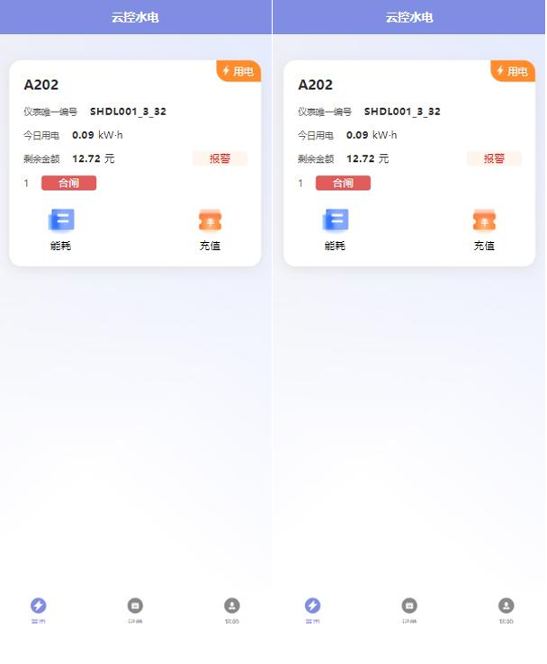

5. 每日能耗情况查看

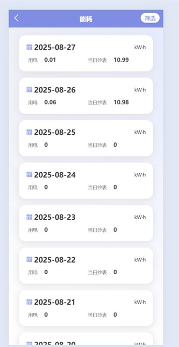

6. 充值
选择金额点击充值后，会弹出一卡通学号和一卡通付费密码，需要学生输入认证

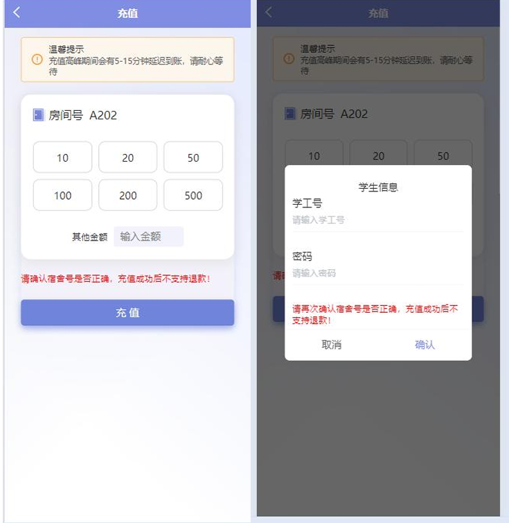

### 老宿舍楼的缴费方式
::: tip  

得益于移动端界面没有自适应，选择宿舍楼的时候，下拉列表不知道会飘到哪去，所以为了体验、准确和方便，

建议优先使用电脑端来完成充值动作。

:::
1. 直接在浏览器输入网址  **10.50.2.206**,或者直接点击[电费充值](http://10.50.2.206)，进入登陆界面

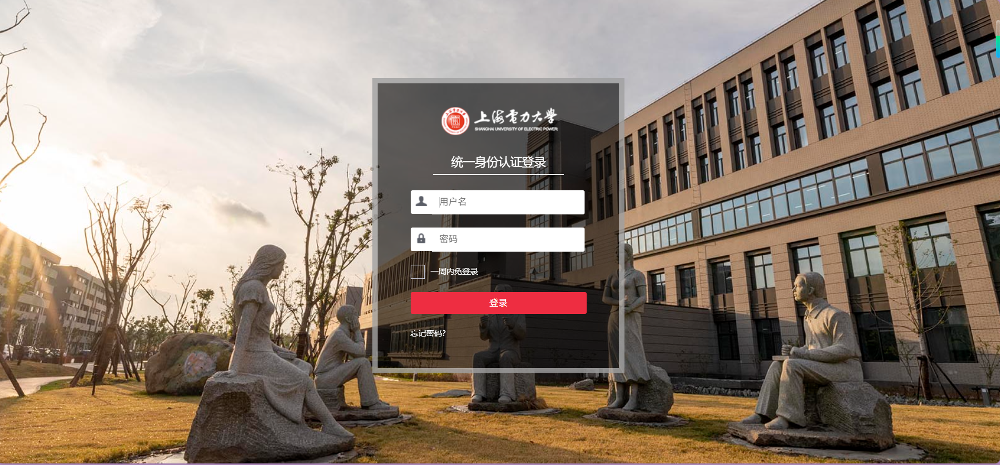

2. 登陆成功后，即可进入电费能源管理界面。

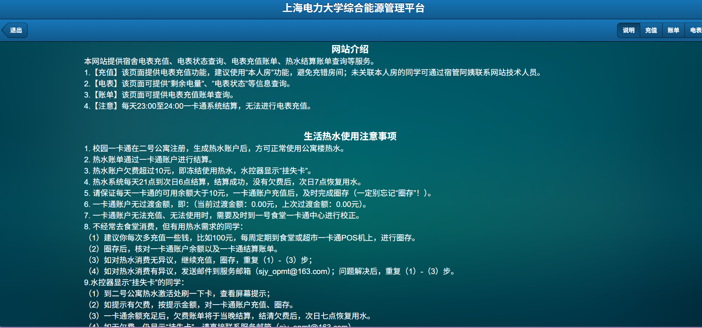

3. 充值界面，可以自行选择“寝室楼号”、“寝室号”、“充值电费度数”。 点击“本人房”系统会自动输入登陆者的宿舍信息，并默认填写充值度数为100度。

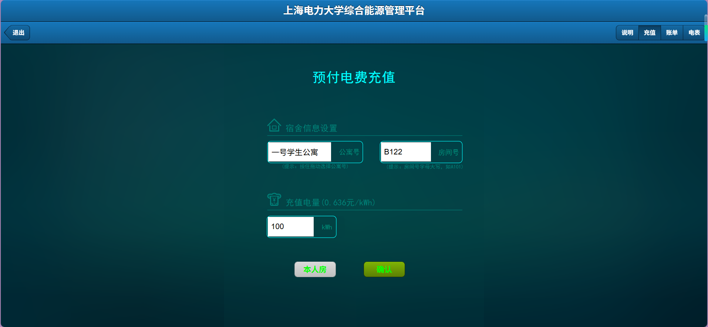

4. 账单页面，目前仅可以查看本人的缴费记录，不能查到同寝室其他人的缴费，是以个人为范围查询的。

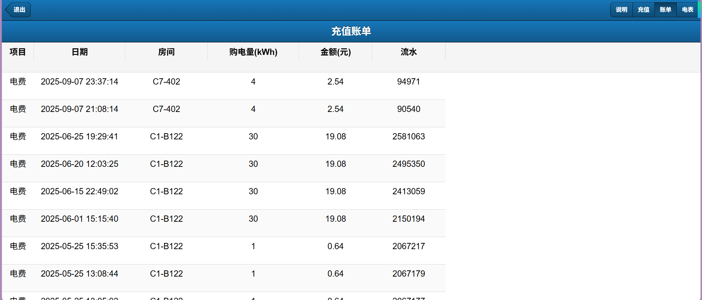

5. 电表，可以查看电表状态以及相关参数信息

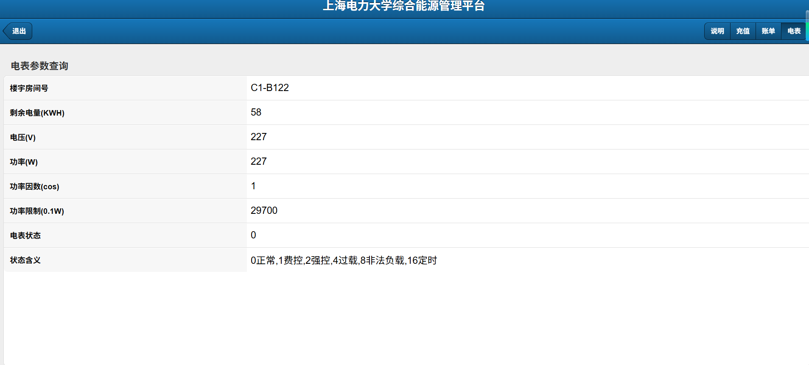

### 可能遇到的问题

在老宿舍缴费时，输入10.50.2.206进入登陆界面之后，正确的输入了账号密码，可能会直接跳转到undefined页面，如图. 解决方案是删除网址上的/undefined重新刷新，或者直接重新输入10.50.2.206。

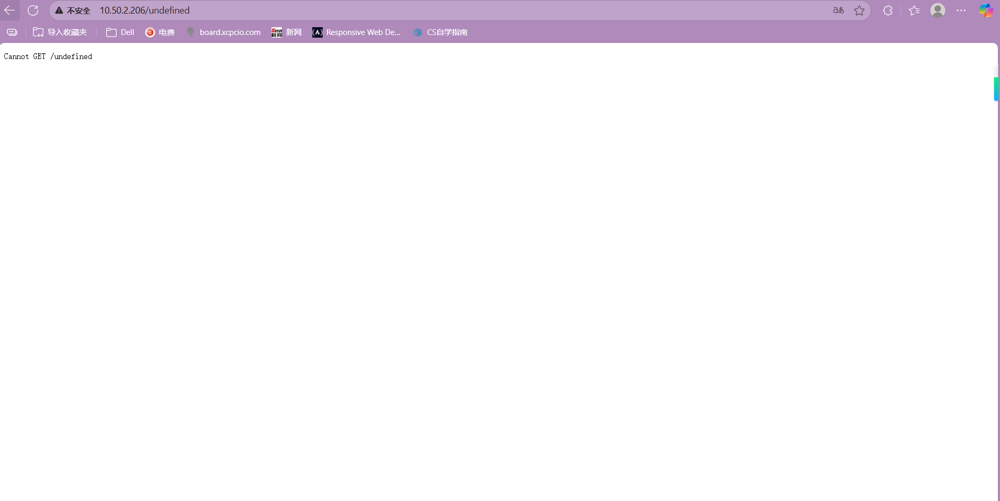

## 3.额外的tip——断电制度
学期初和学期末不断电，一般情况下在开学后两周实行断电制度直到考试周（期末考试前两周）停止。

| 时间         |   说明       |
| ------------ |  ---------- |
| 学期开始之后两周内 |  不断电 |
| 二者之间  |  断电 |
| 学期结束之前两周内 |  不断电 |

实行断电制度期间：  

| 时间         |   说明       |
| ------------ |  ---------- |
| 周一到周四、周日 | 晚23点断电熄灯  |
| 周五到周六 | 晚24点断电熄灯  |

这一点与寝室关门时间吻合。

学期初，什么时候开始断电；学期末，什么时候开始不断电，都会有明确的通知，具体时间请以通知为准。
